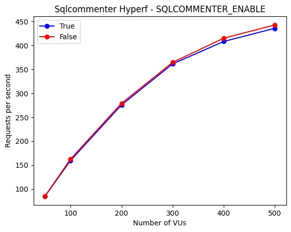

中文 | [Português](./README-PT.md) | [English](./README.md)

<p align="center"><a href="https://google.github.io/sqlcommenter/" target="_blank" rel="noopener noreferrer"></a></p>

<p align="center">
  <a href="https://github.com/reinanhs/sqlcommenter-hyperf/releases"></a>
  <a href="https://www.php.net"></a>
  <a href="https://packagist.org/packages/reinanhs/sqlcommenter-hyperf"></a>
  <a href="https://github.com/reinanhs/sqlcommenter-hyperf/blob/main/LICENSE"></a>
</p>

## 介绍

Sqlcommenter Hyperf 是一个库，旨在为 [Hyperf](https://github.com/hyperf/hyperf) 框架执行的 SQL 查询自动添加注释。这些注释使用 [sqlcommenter](https://google.github.io/sqlcommenter/) 格式，该格式被各种数据库工具和服务理解，为您的应用程序数据库交互提供更好的见解和可追溯性。

## 安装

您可以通过 Composer 安装该库：

```shell
composer require reinanhs/sqlcommenter-hyperf
```

添加组件配置：

```shell
php bin/hyperf.php vendor:publish reinanhs/sqlcommenter-hyperf
```

## 示例

以下是一个简单查询的示例：

```sql
select *
from users
```

使用该库后，查询将如下所示：

```sql
select *
from users /*framework='Hyperf',
application='hyperf-skeleton',
controller='UserController',
action='index',
route='%%2Fapi%%2Ftest',
db_driver='mysql',
traceparent='00-1cd60708968a61e942b5dacc2d4a5473-7534abe7ed36ce35-01'*/
```

通过检查上面的 SQL 语句及其注释 `/*...*/`，我们可以将 SQL 查询中的字段与我们的 web 应用程序中的源代码相关联并识别出来：

> 表1：每种注释类型的描述信息

| 原始字段                                                                 | 解释                                                                                     |
|--------------------------------------------------------------------------|------------------------------------------------------------------------------------------|
| **framework**='Hyperf'                                                   | “Hyperf” 代表生成查询的框架。                                                            |
| **application**='hyperf-skeleton'                                        | 运行代码的项目名称。                                                                     |
| **controller**='UserController'                                          | 控制器的名称，在 `app/Controller` 中。                                                   |
| **action**='index'                                                       | 控制器调用的方法名称。                                                                   |
| **route**='%%2Fapi%%2Ftest'                                              | 调用查询时使用的路由。                                                                   |
| **db_driver**='mysql'                                                    | Hyperf 数据库引擎的名称。                                                                |
| **traceparent**='00-1cd60708968a61e942b5dacc2d4a5473-7534abe7ed36ce35-01'| OpenTelemetry trace 的 [W3C TraceContext Traceparent](https://www.w3.org/TR/trace-context/#traceparent-field) 字段。|

各种工具和服务可以解释这些注释，帮助将用户代码与 ORM 生成的 SQL 语句相关联，并可以在数据库服务器日志中进行检查。这为您的应用程序状态提供了更好的可观察性，直到数据库服务器。

以下是这些信息在 [Google Cloud SQL](https://cloud.google.com/sql/docs/postgres/using-query-insights) 中的显示示例：


上图展示了 sqlcommenter 信息在 Google Cloud 中的映射。在这种情况下，sqlcommenter 被用来在 Query Insights 中添加标签，从而更容易识别导致性能问题的应用程序代码部分。

点击这些标签之一，您可以查看有关查询的详细信息。请参见以下示例：


除了 **Cloud SQL** 之外，还有许多其他工具也支持 _sqlcommenter_。一个示例是 [Planetscale Query Insights](https://planetscale.com/docs/concepts/query-insights)。

## Trace

通过使用 sqlcommenter-hyperf 库，您可以将 Cloud SQL Query 的追踪信息与您的 Hyperf 项目相关联。通过关联这些信息，您将获得比 Hyperf 默认提供的更详细的可追溯性。

下面是两张图片的对比，显示了 Hyperf 中的标准 SQL 追踪信息和 Cloud SQL Query 的追踪信息：

下图展示了 Hyperf 中的标准 SQL 追踪：


下图展示了与 Hyperf 请求关联的 Cloud SQL 追踪：


使用 sqlcommenter-hyperf 库的一个建议是禁用 Hyperf 的默认 SQL 追踪，因为通过 GCP 的 Cloud SQL Query 追踪，您将获得更详细的信息。

## 配置

当您将库安装到您的项目中时，它将通过默认配置自动启用。因此，要使用此库，您只需将其安装到项目中。

但是，如果您想禁用某些注释，可以通过配置来实现。此外，您还可以通过配置完全禁用特定环境中的此库的执行。

通过以下配置，您可以启用或禁用该库生成的注释。默认情况下，所有注释都是启用的。您可以在 `config/autoload/sqlcommenter.php` 文件中找到此配置：

```php
'enable' => env('SQLCOMMENTER_ENABLE', true),
'include' => [
    'framework' => env('SQLCOMMENTER_ENABLE_FRAMEWORK', true),
    'controller' => env('SQLCOMMENTER_ENABLE_CONTROLLER', true),
    'action' => env('SQLCOMMENTER_ENABLE_ACTION', true),
    'route' => env('SQLCOMMENTER_ENABLE_ROUTE', true),
    'application' => env('SQLCOMMENTER_ENABLE_APPLICATION', true),
    'db_driver' => env('SQLCOMMENTER_ENABLE_DB_DRIVER', true),
],
```

以下是每个配置的详细说明：

| 配置                    | 类型      | 默认值    | 说明                                                                |
|-----------------------|---------|--------|-------------------------------------------------------------------|
| `enable`              | Boolean | `true` | 控制 SQLCommenter 是否启用。设置为 `true` 以启用 SQLCommenter 并将注释添加到 SQL 查询中。 |
| `include.framework`   | Boolean | `true` | 在 SQL 注释中包括使用的框架名称。                                               |
| `include.controller`  | Boolean | `true` | 在 SQL 注释中包括生成查询的控制器名称。                                            |
| `include.action`      | Boolean | `true` | 在 SQL 注释中包括控制器中生成查询的操作或方法名称。                                      |
| `include.route`       | Boolean | `true` | 在 SQL 注释中包括生成查询的请求相关联的路由。                                         |
| `include.application` | Boolean | `true` | 在 SQL 注释中包括应用程序的名称。                                               |
| `include.db_driver`   | Boolean | `true` | 在 SQL 注释中包括用于执行查询的数据库驱动程序名称。                                      |

## 功能

- 自动向 SQL 查询添加兼容 sqlcommenter 的注释。
- 提供更好的可追溯性和数据库交互的见解。
- 与 Hyperf 框架轻松集成。
- 支持多种数据库驱动程序。

## 性能

使用 Sqlcommenter Hyperf 库可能会引入一些性能影响，因为它会向 SQL 查询添加注释。然而，在可追溯性、调试的便利性和与监控工具的集成方面的好处通常超过了这些影响。

为了展示 Sqlcommenter Hyperf 库的有效性，我们将进行两个不同的测试。测量将在 Google Cloud Run 的受控环境中进行，配置如下：

- CPU 始终分配
- 最小实例数：1
- 最大实例数：1
- 每个实例的内存：1GB
- 每个实例的 vCPU 数量：1vCPU
- 每个实例的最大并发请求数：1000

以下是用于实验的项目：

- [sample-sqlcommenter-hyperf-poc](https://github.com/ReinanHS/sample-sqlcommenter-hyperf-poc)

### 代码块的平均执行时间测试：

在此测试中

，我们将测量添加 SQL 注释的 SqlCommenterAspect 代码块的平均执行时间。在收集了 10,000 条执行时间记录后，我们计算出平均执行时间约为 **0.103 毫秒 (ms)**。

该值表明将 SQL 注释插入查询是一项极快的操作，几乎不会对查询的总执行时间产生影响。

- [有关代码块平均执行时间测试的完整文档](https://github.com/ReinanHS/sqlcommenter-hyperf/wiki/Performance#performance-analysis-of-the-code-block-in-the-library)

### 请求延迟性能测试

在此测试中，我们将使用 K6 进行多次请求，并比较启用和禁用库时的性能。请参阅下面的实验结果：



通过分析上图，我们可以看到，最初两种配置的响应时间非常相似。然而，随着 CPU 消耗的增加并接近 1 vCPU 的限制，禁用配置（False）的性能略有提升。通过检查 CPU 利用率图表，我们观察到在大约 400 VUs 时，两种配置的 CPU 使用率均约为 98%。

当库不在 CPU 使用上进行激烈竞争时，它可以保持非常好的性能，接近禁用配置。这表明，在高需求条件下，禁用配置可以稍微更好地处理负载，从而导致每秒处理的请求数略有增加。

如果您想查看有关测试的详细信息，建议点击以下链接：

- [有关请求延迟性能测试的完整文档](https://github.com/ReinanHS/sqlcommenter-hyperf/wiki/Performance#request-latency-performance-test)

## 更新日志

请参阅 [CHANGELOG](CHANGELOG.md) 了解最近的更改。

## 贡献

您想成为这个项目的一部分吗？请阅读 [如何贡献](CONTRIBUTING.md)。

## 安全漏洞

请查看 [我们的安全政策](https://github.com/reinanhs/sqlcommenter-hyperf/security/policy) 了解如何报告安全漏洞。

### 许可证

此项目已获得许可。有关详细信息，请参阅 [LICENSE](LICENSE) 文件。