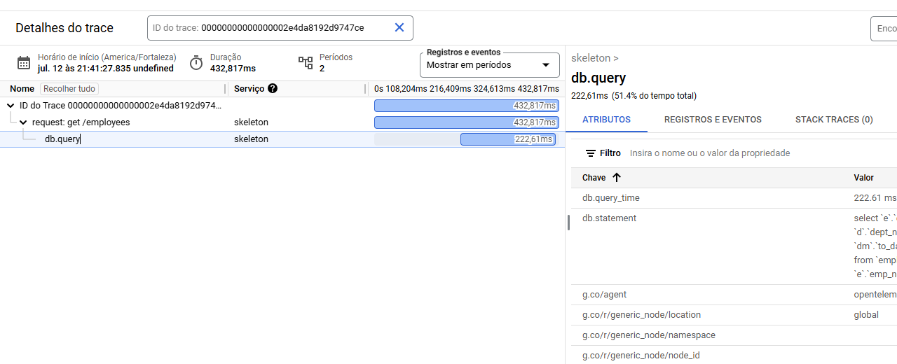
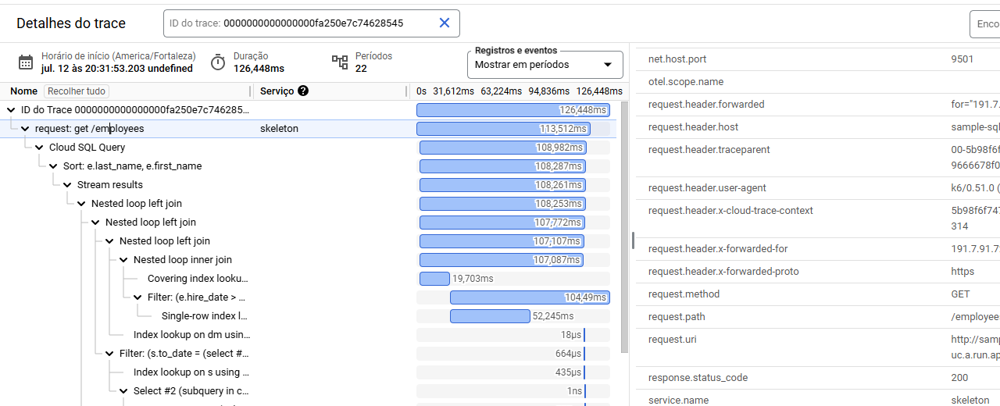

Português | [English](./README.md)

<p align="center"><a href="https://google.github.io/sqlcommenter/" target="_blank" rel="noopener noreferrer"></a></p>

<p align="center">
  <a href="https://github.com/reinanhs/sqlcommenter-hyperf/releases"></a>
  <a href="https://www.php.net"></a>
  <a href="https://packagist.org/packages/reinanhs/sqlcommenter-hyperf"></a>
  <a href="https://github.com/reinanhs/sqlcommenter-hyperf/blob/main/LICENSE"></a>
</p>

## Introdução

Sqlcommenter Hyperf é uma biblioteca projetada para adicionar automaticamente comentários às consultas SQL executadas pelo
framework [Hyperf](https://github.com/hyperf/hyperf). Esses comentários usam o formato
[sqlcommenter](https://google.github.io/sqlcommenter/), que é entendido por várias ferramentas e serviços de banco de dados,
proporcionando insights e rastreabilidade aprimorados para as interações de banco de dados da sua aplicação.

## Instalação

Você pode instalar a biblioteca via Composer:

```shell
composer require reinanhs/sqlcommenter-hyperf
```

Adicione a configuração do componente:

```shell
php bin/hyperf.php vendor:publish reinanhs/sqlcommenter-hyperf
```

## Exemplo

Veja um exemplo de uma consulta simples sendo executada:

```sql
select *
from users
```

Usando essa biblioteca, a consulta ficará assim:

```sql
select *
from users /*framework='Hyperf',
application='hyperf-skeleton',
controller='UserController',
action='index',
route='%%2Fapi%%2Ftest',
db_driver='mysql',
traceparent='00-1cd60708968a61e942b5dacc2d4a5473-7534abe7ed36ce35-01'*/
```

Ao examinar a instrução SQL acima e seu comentário em `/*...*/`, podemos correlacionar e identificar os campos na consulta SQL com o nosso código fonte na nossa aplicação web:

> Tabela 1: Informação sobre a descrição de cada tipo de comentário

| CAMPO ORIGINAL                                                            | INTERPRETAÇÃO                                                                                                               |
|---------------------------------------------------------------------------|-----------------------------------------------------------------------------------------------------------------------------|
| **framework**='Hyperf'                                                    | A palavra "Hyperf" representa o framework que gerou a consulta.                                                             |
| **application**='hyperf-skeleton'                                         | O nome do projeto onde o código foi executado.                                                                              |
| **controller**='UserController'                                           | Nome do controlador em `app/Controller`.                                                                                    |
| **action**='index'                                                        | Nome do método chamado pelo controlador.                                                                                    |
| **route**='%%2Fapi%%2Ftest'                                               | A rota usada durante a chamada da consulta.                                                                                 |
| **db_driver**='mysql'                                                     | O nome do motor de banco de dados Hyperf.                                                                                   |
| **traceparent**='00-1cd60708968a61e942b5dacc2d4a5473-7534abe7ed36ce35-01' | O campo [W3C TraceContext Traceparent](https://www.w3.org/TR/trace-context/#traceparent-field) do trace OpenTelemetry.      |

Várias ferramentas e serviços podem interpretar esses comentários, ajudando a correlacionar o código do usuário com as instruções SQL geradas pelo ORM, e podem ser examinadas nos logs do servidor de banco de dados. Isso fornece uma melhor observabilidade do estado da sua aplicação até o servidor de banco de dados.

Aqui está um exemplo de como essas informações aparecem no [Google Cloud SQL](https://cloud.google.com/sql/docs/postgres/using-query-insights):


A imagem acima ilustra como as informações do sqlcommenter são mapeadas dentro do Google Cloud. Nesse contexto, o sqlcommenter está sendo usado para adicionar tags no Query Insights, facilitando a identificação de qual parte do código da aplicação está causando problemas de desempenho.

Ao clicar em uma dessas tags, você poderá visualizar informações detalhadas sobre as consultas. Veja o exemplo abaixo:


Além do **Cloud SQL**, várias outras ferramentas também suportam _sqlcommenter_. Um exemplo é o [Planetscale Query Insights](https://planetscale.com/docs/concepts/query-insights).

## Trace

Ao usar a biblioteca sqlcommenter-hyperf, você pode vincular as informações de trace do Cloud SQL Query com seu projeto Hyperf. Ao correlacionar suas informações, você alcançará um nível de rastreabilidade muito mais detalhado do que o fornecido pelo Hyperf por padrão.

Abaixo está uma comparação entre duas imagens mostrando as informações de trace do SQL padrão no Hyperf e do trace do Cloud SQL Query:

A imagem abaixo exemplifica o trace do SQL padrão no Hyperf:



A imagem abaixo exemplifica o trace do Cloud SQL associado a uma requisição no Hyperf:



Uma dica ao usar a biblioteca sqlcommenter-hyperf é desabilitar o trace SQL padrão no Hyperf, pois você obterá informações mais detalhadas através do trace do Cloud SQL Query na GCP.

## Configuração

Quando você instala a biblioteca em seu projeto, ela será automaticamente habilitada através das configurações padrão. Portanto, para usar esta biblioteca, você só precisa tê-la instalada em seu projeto.

No entanto, se desejar desabilitar alguns comentários, você pode fazer isso através das configurações. Também vale mencionar que você pode desabilitar completamente a execução desta biblioteca em um ambiente específico através das configurações.

Com as configurações abaixo, você pode habilitar ou desabilitar os comentários gerados por esta biblioteca. Por padrão, todos os comentários estão habilitados. Você encontrará essa configuração no arquivo `config/autoload/sqlcommenter.php`:

```php
'enable' => env('SQLCOMMENTER_ENABLE', true),
'include' => [
    'framework' => env('SQLCOMMENTER_ENABLE_FRAMEWORK', true),
    'controller' => env('SQLCOMMENTER_ENABLE_CONTROLLER', true),
    'action' => env('SQLCOMMENTER_ENABLE_ACTION', true),
    'route' => env('SQLCOMMENTER_ENABLE_ROUTE', true),
    'application' => env('SQLCOMMENTER_ENABLE_APPLICATION', true),
    'db_driver' => env('SQLCOMMENTER_ENABLE_DB_DRIVER', true),
],
```

Veja abaixo uma explicação detalhada de cada uma das configurações:

| Configuração          | Tipo    | Padrão | Descrição                                                                                                                      |
|-----------------------|---------|--------|--------------------------------------------------------------------------------------------------------------------------------|
| `enable`              | Boolean | `true` | Controla se o SQLCommenter está habilitado ou desabilitado. Defina como `true` para habilitar o SQLCommenter e adicionar comentários às consultas SQL. |
| `include.framework`   | Boolean | `true` | Inclui o nome do framework usado nos comentários SQL.                                                                           |
| `include.controller`  | Boolean | `true` | Inclui o nome do controlador responsável pela ação que gerou a consulta SQL.                                                    |
| `include.action`      | Boolean | `true` | Inclui o nome da ação ou método dentro do controlador que gerou a consulta SQL.                                                 |
| `include.route`       | Boolean | `true` | Inclui a rota associada à requisição que gerou a consulta SQL.                                                                  |
| `include.application` | Boolean | `true` | Inclui o nome da aplicação nos comentários SQL.                                                                                 |
| `include.db_driver`   | Boolean | `true` | Inclui o nome do driver de banco de dados usado para executar a consulta SQL.                                                   |

## Funcionalidades

- Adiciona automaticamente comentários compatíveis com sqlcommenter às consultas SQL.
- Proporciona melhor rastreabilidade e insights nas interações com o banco de dados.
- Integração fácil com o framework Hyperf.
- Suporta múltiplos drivers de banco de dados.

## Desempenho

Usar a biblioteca Sqlcommenter Hyperf pode introduzir um pequeno impacto de desempenho devido à adição de comentários às consultas SQL. No entanto, os benefícios em termos de rastreabilidade, facilidade de depuração e integração com ferramentas de monitoramento geralmente superam esse impacto.

Para demonstrar a eficácia da biblioteca Sqlcommenter Hyperf, realizaremos dois testes distintos. A medição será realizada em um ambiente controlado do Google Cloud Run com as seguintes configurações:

- CPU sempre alocada
- Número mínimo de instâncias: 1
- Número máximo de instâncias: 1
- Memória por instância: 1GB
- Número de vCPUs por instância: 1vCPU
- Máximo de requisições concorrentes por instância: 1000

Veja abaixo o projeto que foi usado como experimento:

- [sample-sqlcommenter-hyperf-poc](https://github.com/ReinanHS/sample-sqlcommenter-hyperf-poc)

### Teste de tempo médio de execução do bloco de código:

Neste teste, mediremos o tempo médio de execução do bloco de código SqlCommenterAspect que adiciona comentários SQL. Após coletar 10.000 registros de tempo de execução para esta operação, calculamos o tempo médio de execução, que foi de aproximadamente **0.103 milissegundos (ms)**.

Esse valor indica que a inserção de comentários SQL nas consultas é uma operação extremamente rápida, adicionando um overhead insignificante ao tempo total de execução da consulta.

- [Documentação completa sobre o teste de tempo médio de execução do bloco de código](https://github.com/ReinanHS/sqlcommenter-hyperf/wiki/Performance#average-execution-time-test-of-the-code-block)

### Teste de desempenho de latência de requisição

Neste teste, usaremos K6 para fazer várias requisições e comparar o desempenho com a biblioteca habilitada e desabilitada. Veja os resultados deste experimento abaixo:


Ao analisar a imagem acima, podemos ver que inicialmente os tempos de resposta são muito semelhantes para ambas as configurações. No entanto, à medida que o consumo de CPU aumenta e nos aproximamos do limite de 1 vCPU, a configuração desabilitada (False) começa a apresentar um desempenho ligeiramente melhor. Ao examinar os gráficos de utilização da CPU, observamos que em torno de 400 VUs, o uso da CPU era de aproximadamente 98% para ambas as configurações.

Quando a biblioteca não está competindo intensamente pelo uso da CPU, ela consegue manter um desempenho muito bom, próximo ao da configuração desabilitada. Isso sugere que em condições de alta demanda, a configuração desabilitada pode lidar com a carga ligeiramente melhor, resultando em um aumento marginal no número de requisições atendidas por segundo.

Se você deseja verificar as informações detalhadas sobre o teste, é recomendado clicar no link abaixo:

- [Documentação completa sobre o teste de desempenho de latência de requisição](https://github.com/ReinanHS/sqlcommenter-hyperf/wiki/Performance#request-latency-performance-test)

## Changelog

Por favor, veja o [CHANGELOG](CHANGELOG.md) para mais informações sobre o que mudou recentemente.

## Contribuindo

Você quer fazer parte deste projeto? Leia [como contribuir](CONTRIBUTING.md).

## Vulnerabilidades de segurança

Por favor, revise [nossa política de segurança](https://github.com/reinanhs/sqlcommenter-hyperf/security/policy) sobre como reportar vulnerabilidades de segurança.

### Licença

Este projeto está sob licença. Veja o arquivo [LICENSE](LICENSE) para mais detalhes.
